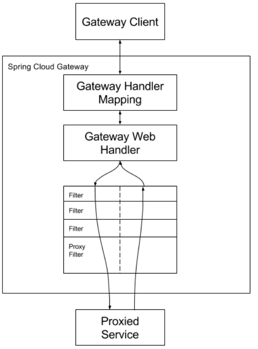

>[我的微服务学习笔记系列目录](https://www.cnblogs.com/mrxiaobai-wen/p/14278656.html)：https://www.cnblogs.com/mrxiaobai-wen/p/14278656.html
>
>在前面简单的了解了一下注册中心Nacos的使用（https://www.cnblogs.com/mrxiaobai-wen/p/14304495.html），然后这两天上手了一下Spring Cloud Gateway，在这里做一个总结。

***

## 微服务网关简介

+ 什么是网关：顾名思义，它就是一个关口，所有想要进入到我们系统的请求都首先要经过这个关口才行。

+ 为什么需要网关：比如我在前面上手Nacos的时候，创建了两个服务，分别是nacos-server-spring-cloud和nacos-consumer-spring-cloud，两个不同的服务，不同的端口，不同的地址。那么我在访问这两个服务的时候要分别记录两个地址访问两个不同的服务。但是这个系统是有机联系的，它们一起组成了一套系统。那么有没有什么方式可以让我只请求一个地方就能获取到我所需要的所有内容呢？那么这里就可以使用上网关。

  我们所有的请求都请求到网关上，至于转到哪一类服务上，转到哪一类服务的哪个实例上，完全由网关自己去判断。

  如下图，用户请求某个服务，微服务系统内部服务之间相互依赖：

  ~~~mermaid
  graph LR
  用户1[用户1] --> 网关[网关]
  用户2[用户2] --> 网关[网关]
  网关[网关] --> 服务一[服务一]
  网关[网关] --> 服务二[服务二]
  网关[网关] --> 服务三[服务三]
  服务一[服务一] --> 服务二[服务二]
  服务三[服务三] --> 服务二[服务二]
  ~~~

  这样，我们就能够屏蔽微服务内部的结构，对外提供一个统一的入口，而外部也不用关注微服务系统内部的结构。

+ 网关能做什么：

  + 负载均衡
  + 限流降级
  + 授权认证
  + 日志记录

  列出的是几个常见的使用场景。

+ 常见微服务网关：
  + [zuul](https://github.com/Netflix/zuul)
  + [kong](https://getkong.org/)
  + [spring cloud gateway](https://github.com/spring-cloud/spring-cloud-gateway)

***

## Spring Cloud Gateway介绍

[Spring Cloud Gateway官方文档](https://cloud.spring.io/spring-cloud-static/spring-cloud-gateway/2.0.4.RELEASE/single/spring-cloud-gateway.html)

Spring Cloud的一个子项目，其设计如图：

它有三个组件：

+ 路由(Route)：一组断言与一组过滤器的集合，是网关的基本组件。

+ 断言(Predicate)：是否匹配路由的判断条件。

+ 过滤器(Filter)：对请求的处理逻辑，比如校验、鉴权、日志记录等等。

整体逻辑就是：请求进入到网关后，首先根据路由配置中的断言匹配handler，然后执行filter链。

***

## Spring Cloud Gateway使用

+ 首先引入必要依赖

  ~~~xml
  <dependencies>
      <dependency>
          <groupId>org.springframework.boot</groupId>
          <artifactId>spring-boot-dependencies</artifactId>
          <version>${spring-boot.version}</version>
          <type>pom</type>
          <scope>import</scope>
      </dependency>
  
      <dependency>
          <groupId>org.springframework.cloud</groupId>
          <artifactId>spring-cloud-dependencies</artifactId>
          <version>${spring-cloud.version}</version>
          <type>pom</type>
          <scope>import</scope>
      </dependency>
  
      <dependency>
          <groupId>com.alibaba.cloud</groupId>
          <artifactId>spring-cloud-alibaba-dependencies</artifactId>
          <version>${spring-cloud-alibaba.version}</version>
          <type>pom</type>
          <scope>import</scope>
      </dependency>
  </dependencies>
  ~~~

  根据我们下面的配置文件，我们使用到了注册中心，所以在这里还要引入nacos的依赖。

+ 创建配置文件application.yml

  ~~~yml
  spring:
    application:
      name: spring-cloud-geteway
    cloud:
      gateway:
        discovery:
          locator:
            enabled: true
            lower-case-service-id: true
        routes:
          - id: nacos-server-spring-cloud
            uri: lb://nacos-server-spring-cloud
            predicates:
              - Path=/nacos-server-spring-cloud/**
            filters:
              - StripPrefix= 1
          - id: nacos-consumer-spring-cloud
            uri: lb://nacos-consumer-spring-cloud
            predicates:
              - Path=/nacos-consumer-spring-cloud/**
            filters:
              - StripPrefix= 1
  ~~~

  注册中心配置bootstrap.yml

  ~~~yml
  spring:
    application:
      name: spring-cloud-geteway
    cloud:
      nacos:
        discovery:
          server-addr: 127.0.0.1:8848
        config:
          server-addr: 127.0.0.1:8848
          file-extension: yaml #指定yaml格式的配置
          encode: UTF-8
  ~~~

  其中routes就是配置路由列表，这里使用了之前用到的nacos-server-spring-cloud和nacos-consumer-spring-cloud两个服务。

  ~~~yml
  predicates:
  	- Path=/nacos-server-spring-cloud/**
  ~~~

  则是标识匹配以nacos-server-spring-cloud开头的请求。

  在filters中只用到了一个

  ~~~yml
  - StripPrefix= 1
  ~~~

  表示网关将请求转发到下游服务之前从请求中剥离的路径个数，这里配置了1，那么表示会将前面的nacos-server-spring-cloud路径去掉，然后再按照相应的地址进行转发。

+ 配置主类

  ~~~java
  @SpringBootApplication
  @EnableDiscoveryClient
  public class SpringCloudGatewayApplication {
  
      public static void main(String[] args) {
          SpringApplication.run(SpringCloudGatewayApplication.class, args);
      }
  
  }
  ~~~

上面的准备工作做完后，启动网关、server、consumer、nacos服务，然后请求网关即可转发到对应的微服务上了。

代码完整地址：

https://github.com/mrxiaobai-wen/springcloud_study

