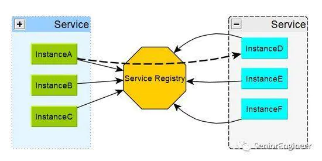
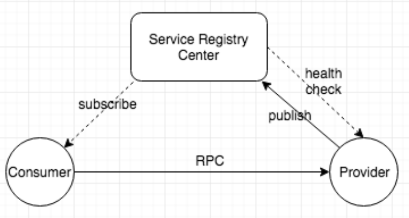

> 在单体应用中，所有功能都在一个应用中，但是随着业务增长，系统功能逐渐变得庞大，单体应用在开发、部署等方面效率逐渐低下，开发协同越来越困难，等等问题。因此，对系统进行拆分变的必要。
>
> 但是在微服务架构中，越来越多的服务被拆分出来，整个系统之间的调用关系也会越来越复杂，各个服务管理也会变的越来越困难。那么对这种数量极多、依赖关系复杂的系统如何进行管理成为了一个问题。
>
> 这时需要一个注册中心进行服务治理。

***

## 注册中心是什么

首先，在微服务架构中，注册中心是什么？

一张图进行概括，它就是一张通讯录：

它将各个服务的信息进行存储，然后提供给需要者，同时维护各种过期失效的内容。

***

## 注册中心原理

在微服务中，有三个非常重要的角色：注册中心、服务提供者、服务消费者。对应关系如下：

对应的过程如下：

+ 各个服务启动信息注册到注册中心，注册中心保存注册数据。
+ 各个服务注册成功后，上传服务健康信息到注册中心进行保活。
+ 各个服务消费者启动时向注册中心订阅服务信息，获取服务地址列表，注册中心在服务列表发生变化时同步给服务订阅者。
+ 各个服务消费者调用服务提供者。

***

## 注册中心功能

根据上图中的信息，大致可以列出注册中心要提供的功能如下：

+ 服务注册表：注册中心的核心功能，记录各个服务提供者的信息，比如服务名、IP、端口等。维护服务订阅者信息。
+ 服务注册、注销接口：供服务提供方进行服务注册和服务注销。
+ 健康检查和服务摘除：提供健康信息上报接口，供注册服务上传健康信息进行服务保活。同时对于失效节点能够及时摘除并同步给服务订阅者。
+ 服务订阅和变更通知：供服务消费者使用。

***

## 注册中心实现机制

服务注册模式主要分为两种：自注册模式、第三方注册模式。

### 自注册模式

每个服务自己向注册中心进行注册和注销，同时上传健康信息到注册中心来保持注册有效。

+ 优点：实现方式简单，不需要部署其它额外的组件。

+ 缺点：耦合度较高，服务端需要和注册中心进行适配。

### 第三方注册模式

每个服务实例不需要自己直接向注册中心进行注册和注销，同时也不需要关注自己的健康信息，这些事情直接由第三方组件来做。

+ 优点：服务和注册中心解耦，不需要服务按照注册中心来进行适配。

+ 缺点：第三方组件需要保证高可用，引入第三方服务也增加了系统的复杂度。

