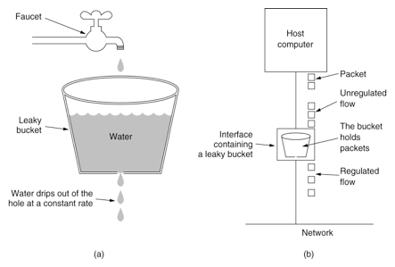
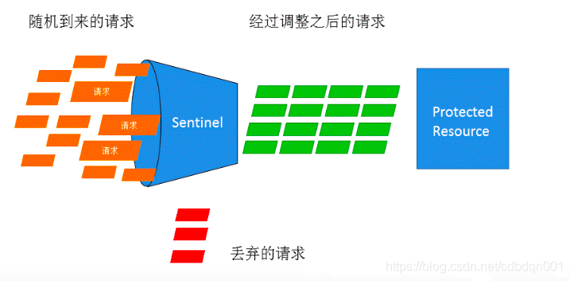

> 距离上次总结Sentinel的滑动窗口算法已经有些时间了，原本想着一口气将它的core模块全部总结完，但是中间一懒就又松懈下来了，这几天在工作之余又重新整理了一下，在这里做一个学习总结。
>
> 上篇滑动窗口算法总结链接：https://www.cnblogs.com/mrxiaobai-wen/p/14212637.html
>
> 今天主要总结了一下Sentinel的快速失败和匀速排队的漏桶算法。因为它的WarmUpController和WarmUpRateLimiterController对应的令牌桶算法的数学计算原理有一点点复杂，所以我准备在后面单独用一篇来总结。所以今天涉及到的主要就是DefaultController和RateLimiterController。

***

## 限流策略入口

首先进入到FlowRuleUtil类中，方法generateRater就是对应策略的创建，逻辑比较简单，代码如下：

~~~java
private static TrafficShapingController generateRater(FlowRule rule) {
    if (rule.getGrade() == RuleConstant.FLOW_GRADE_QPS) {
        switch (rule.getControlBehavior()) {
            case RuleConstant.CONTROL_BEHAVIOR_WARM_UP:
                // WarmUp-令牌桶算法
                return new WarmUpController(rule.getCount(), rule.getWarmUpPeriodSec(),
                    ColdFactorProperty.coldFactor);
            case RuleConstant.CONTROL_BEHAVIOR_RATE_LIMITER:
                // 排队等待-漏桶算法
                return new RateLimiterController(rule.getMaxQueueingTimeMs(), rule.getCount());
            case RuleConstant.CONTROL_BEHAVIOR_WARM_UP_RATE_LIMITER:
                // 预热和匀速排队结合
                return new WarmUpRateLimiterController(rule.getCount(), rule.getWarmUpPeriodSec(),
                    rule.getMaxQueueingTimeMs(), ColdFactorProperty.coldFactor);
            case RuleConstant.CONTROL_BEHAVIOR_DEFAULT:
            default:
                // Default mode or unknown mode: default traffic shaping controller (fast-reject).
        }
    }
    // 快速失败
    return new DefaultController(rule.getCount(), rule.getGrade());
}
~~~

***

## 快速失败DefaultController

默认流控算法代码如下：

~~~java
@Override
public boolean canPass(Node node, int acquireCount, boolean prioritized) {
    int curCount = avgUsedTokens(node);
    // 当前阈值 + acquireCount 是否大于规则设定的count，小于等于则表示符合阈值设定直接返回true
    if (curCount + acquireCount > count) {
        // 在大于的情况下，针对QPS的情况会对先进来的请求进行特殊处理
        if (prioritized && grade == RuleConstant.FLOW_GRADE_QPS) {
            long currentTime;
            long waitInMs;
            currentTime = TimeUtil.currentTimeMillis();
            // 如果策略是QPS，那么对于优先请求尝试去占用下一个时间窗口中的令牌
            waitInMs = node.tryOccupyNext(currentTime, acquireCount, count);
            if (waitInMs < OccupyTimeoutProperty.getOccupyTimeout()) {
                node.addWaitingRequest(currentTime + waitInMs, acquireCount);
                node.addOccupiedPass(acquireCount);
                sleep(waitInMs);

                // PriorityWaitException indicates that the request will pass after waiting for {@link @waitInMs}.
                throw new PriorityWaitException(waitInMs);
            }
        }
        return false;
    }
    return true;
}
~~~

先看一下涉及到的avgUsedTokens方法：

~~~java
private int avgUsedTokens(Node node) {
    if (node == null) {
        return DEFAULT_AVG_USED_TOKENS;
    }
    // 获取当前qps或者当前线程数
    return grade == RuleConstant.FLOW_GRADE_THREAD ? node.curThreadNum() : (int)(node.passQps());
}
~~~

主要是获取已使用的令牌数，如果设置的阈值类型为线程数，那么返回当前统计节点中保存的线程数，如果设置的阈值类型为QPS，那么返回已经通过的QPS数。

然后回到上面的canPass方法，其主要逻辑就是在获取到目前节点的统计数据后，将已占用的令牌数与请求的令牌数相加，如果小于设定的阈值，那么直接放行。

如果大于设置的阈值，那么在阈值类型为QPS且允许优先处理先到的请求的情况下进行特殊处理，否则返回false不放行。

上面特殊处理就是：首先尝试去占用后面的时间窗口的令牌，获取到等待时间，如果等待时间小于设置的最长等待时长，那么就进行等待，当等待到指定时间后返回。否则直接返回false不放行。

由代码可以看出，在等待指定时长后，抛出PriorityWaitException进行放行，对应实现的地方在StatisticSlot中，对应entry方法代码如下：

~~~java
@Override
public void entry(Context context, ResourceWrapper resourceWrapper, DefaultNode node, int count,
                  boolean prioritized, Object... args) throws Throwable {
    try {
        // Do some checking.
        fireEntry(context, resourceWrapper, node, count, prioritized, args);
        // 说明：省略了执行通过的处理逻辑
    } catch (PriorityWaitException ex) {
        node.increaseThreadNum();
        if (context.getCurEntry().getOriginNode() != null) {
            context.getCurEntry().getOriginNode().increaseThreadNum();
        }
        if (resourceWrapper.getEntryType() == EntryType.IN) {
            Constants.ENTRY_NODE.increaseThreadNum();
        }
        for (ProcessorSlotEntryCallback<DefaultNode> handler : StatisticSlotCallbackRegistry.getEntryCallbacks()) {
            handler.onPass(context, resourceWrapper, node, count, args);
        }
    } catch (BlockException e) {
        // 说明：省略了阻塞异常处理逻辑
        throw e;
    } catch (Throwable e) {
        context.getCurEntry().setError(e);
        throw e;
    }
}
~~~

对这个方法去除了其它多余代码，可以看出在PriorityWaitException异常捕捉的代码中没有继续抛出，所以对该请求进行了放行。

***

## 匀速排队-漏桶算法RateLimiterController

对于漏桶算法，首先在网上盗用一张图如下：

图片来源：https://blog.csdn.net/tianyaleixiaowu/article/details/74942405

其思路是：水流（请求）先进入到漏桶里，漏桶以一定的速率匀速流出，当流入量过大的时候，多余水流（请求）直接溢出，从而达到对系统容量的保护。

对应Sentinel使用漏桶算法进行流量整形的效果就如下图所示：

来看RateLimiterController的canPass方法：

~~~java
@Override
public boolean canPass(Node node, int acquireCount, boolean prioritized) {
    if (acquireCount <= 0) {
        return true;
    }
    if (count <= 0) {
        return false;
    }

    long currentTime = TimeUtil.currentTimeMillis();
    // 计算此次令牌颁发所需要的时间，其中： (1.0 / count * 1000)代表每个令牌生成的耗时，然后乘以acquireCount得到此次所需令牌生成耗时
    long costTime = Math.round(1.0 * (acquireCount) / count * 1000);
    // 在上次通过时间的基础上加上本次的耗时，得到期望通过的时间点
    long expectedTime = costTime + latestPassedTime.get();

    if (expectedTime <= currentTime) {
        // 如果期望时间小于当前时间，那么说明当前令牌充足，可以放行，同时将当前时间设置为上次通过时间
        latestPassedTime.set(currentTime);
        return true;
    } else {
        // 当期望时间大于当前时间，那么说明令牌不够，需要等待
        long waitTime = costTime + latestPassedTime.get() - TimeUtil.currentTimeMillis();
        if (waitTime > maxQueueingTimeMs) {
            // 如果需要等待时间大于设置的最大等待时长，那么直接丢弃，不用等待，下面同理
            return false;
        } else {
            long oldTime = latestPassedTime.addAndGet(costTime);
            try {
                // 再次检查等待时长
                waitTime = oldTime - TimeUtil.currentTimeMillis();
                if (waitTime > maxQueueingTimeMs) {
                    latestPassedTime.addAndGet(-costTime);
                    return false;
                }
                // in race condition waitTime may <= 0
                if (waitTime > 0) {
                    Thread.sleep(waitTime);
                }
                return true;
            } catch (InterruptedException e) {
            }
        }
    }
    return false;
}
~~~

Sentinel的令牌桶算法和漏桶算法都参考了Guava RateLimiter的设计。

上面的逻辑很清晰，其思路就是根据当前令牌请求数量acquireCount乘以令牌生成速率得到本次所需令牌的生成时间，然后加上上次通过时间得到一个本次请求的期望通过时间，如果期望通过时间小于当前时间那么说明容量足够直接通过，如果期望通过时间大于当前时间那么说明系统容量不够需要等待，然后结合设置的等待时间判断是继续等待还是直接放弃。

需要特别注意的是，匀速模式具有局限性，它只支持1000以内的QPS。我们可以看对应的语句：

~~~java
long costTime = Math.round(1.0 * (acquireCount) / count * 1000);
long expectedTime = costTime + latestPassedTime.get();
~~~

很容易得到如下结果，每种阈值对应的令牌生成时间(单位：毫秒)：

| count | costTime |
| ----- | -------- |
| 100   | 10       |
| 1000  | 1        |
| 2000  | 1        |
| 3000  | 0        |

所以当阈值count大于2000后，每个令牌生成的时间间隔计算为0，那么后面的判断就没有意义了。所以Sentinel的匀速器只支持QPS在1000以内的请求。